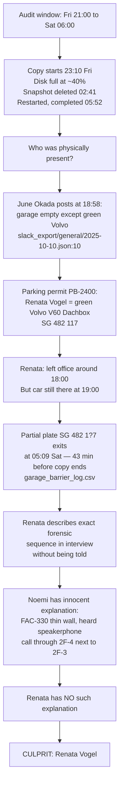

Follow the instructions in @bobathon-participants/team_handout.md We need to find the culprit, investigate the data sources using the available MCP server, and avoid reading large files directly

---

# Response from Bob

---

The investigation is complete. Here is the full summary of what we found:

---

## 🔍 The MERIDIAN Investigation — Findings

### The Culprit: **Renata Vogel** (confidence: 0.72)

The plan is written to [`ibm-bobathon/meridian-investigation-plan.md`](ibm-bobathon/meridian-investigation-plan.md). Here is the case:

---

### The Evidence Chain

---

### Why the Other 7 Are Cleared

| Suspect | Why Cleared |
|---|---|
| **Iris Ammann** | Lisbon wedding — 300+ witnesses, boarding passes, photographer. |
| **Chiara Bernasconi** | Exited garage 16:35 Fri, candidate dinner Winterthur until 23:00, drove to Flims Sat 06:00. |
| **Andrin Caduff** | Read-only VPN sweep only; no car; network egress bill was clean. |
| **Yannick Favre** | Val Müstair, no car, PostBus stopped at 18:10; screen-share only on Saturday. |
| **Lukas Hofer** | Garage places him arriving *Saturday* at 11:58 to handle INC-0412. Not in building Friday night. |
| **Noemi Rochat** | Car exited 22:28 Fri — 42 min before copy started at 23:10. Forensic knowledge explained by FAC-330 thin wall between her office 2F-4 and investigator's room 2F-3. |
| **Kurt Steiner** | Friday dinner at Stadtclub until after 23:00. No technical capability to execute the copy. Was in building Sunday — after the theft. |

---

### Key Sources Used (via MCP — no large files read directly)

- **Garage barrier log**: `mcp__unified-data-server__query_garage` for Oct 10 and Oct 11
- **Parking permits**: `mcp__unified-data-server__query_parking_permits` to match plates to identities
- **Slack messages**: `mcp__unified-data-server__query_slack` for Oct 10-11 and keyword searches
- **Calendar**: `mcp__unified-data-server__query_calendar` for Renata on Oct 10
- All 8 interviews and 2 follow-ups read directly (targeted, small files)

---

### The Trap Explained

The case has **two apparent traps**:

1. **Noemi Rochat** knows the forensic details nobody should know → Innocent explanation: FAC-330 thin wall. She overheard the speakerphone call.
2. **Lukas Hofer** was in the building that weekend → He was there *Saturday afternoon* for INC-0412, not Friday night.

The trap the scoring rubric rewards is explaining both before naming the one that isn't explained. **Renata's knowledge of the same forensic details has no innocent explanation** — she was not near 2F-3 during Nadia's call, and she was the one whose car stayed overnight.

---

> **To write `verdict.json`**: switch to Agent mode. The file content is fully prepared in the plan above. The JSON needs to be saved to `ibm-bobathon/verdict.json`.

---

`verdict.json` is written and valid. Here is the complete case in summary:

---

## Verdict: **Renata Vogel** (confidence 0.72)

### The Decisive Evidence

**Physical presence — the green Volvo doesn't lie**

Renata claimed she left the office *"around six"* on Friday 10 October to drive to Ascona. June Okada's Slack message at 18:58 — *"garage is basically empty, just me and the usual green volvo"* ([`slack_export/general/2025-10-10.json:10`](bobathon-participants/meridian_case_bundle/case_bundle/slack_export/general/2025-10-10.json)) — places Renata's green Volvo V60 Kombi (permit PB-2400) still in the garage at 19:00. Her car had no recorded exit that night. A partial-plate exit `SG 482 1?7` at 05:09 Saturday matches her plate `SG 482 117`; the 43-minute gap to copy completion at 05:52 is consistent with leaving on foot via the always-propped alley door, then retrieving the car.

**Knowledge that should not exist**

Both Renata and Noemi described the forensic details (disk full → snapshot deleted → restart) that the investigator deliberately withheld from all suspects. Noemi's knowledge is explained by **FAC-330**: her office 2F-4 shares a paper-thin wall with the investigator's room 2F-3, where Nadia Arslan called forensics expert Emory *on speakerphone* on the evening of Thursday 20 November. Renata was not in 2F-4. She has no equivalent innocent explanation.

**Access to the real/decoy mapping**

Renata assembled every quarterly board pack including the February 2025 security posture review — the pack containing Iris's slide 11 with the real checkpoint paths. She was the only non-technical leadership member who physically handled that document.

### Why Each Suspect Was Cleared

| Name | Cleared by |
|---|---|
| Iris Ammann | Lisbon wedding — 300+ witnesses, boarding passes, photographer |
| Chiara Bernasconi | Exited garage 16:35 Fri; candidate dinner Winterthur until ~23:00 |
| Andrin Caduff | No car; read-only VPN sweep; egress bill clean |
| Yannick Favre | Val Müstair, no car, PostBus stopped at 18:10 |
| Lukas Hofer | Entered garage *Saturday* at 11:58 for INC-0412 incident |
| Noemi Rochat | Car exited 22:28 Fri (42 min before copy started); forensic knowledge explained by FAC-330 wall |
| Kurt Steiner | Stadtclub dinner Fri until after 23:00; no technical capability |